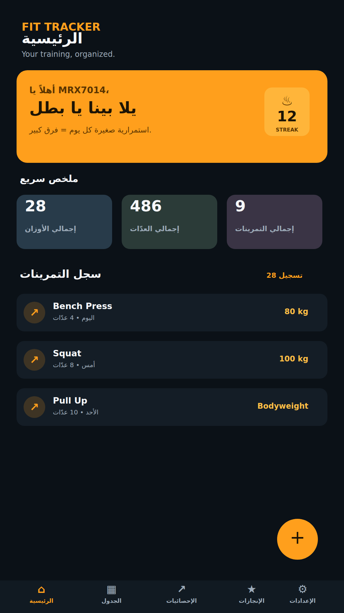
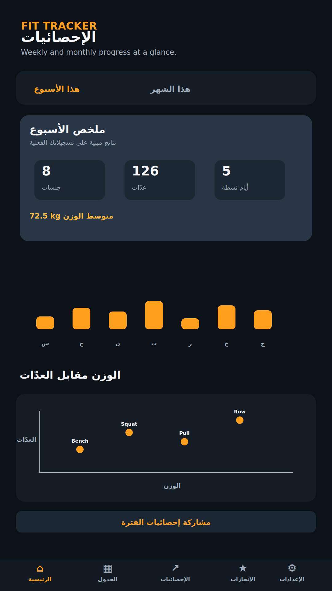
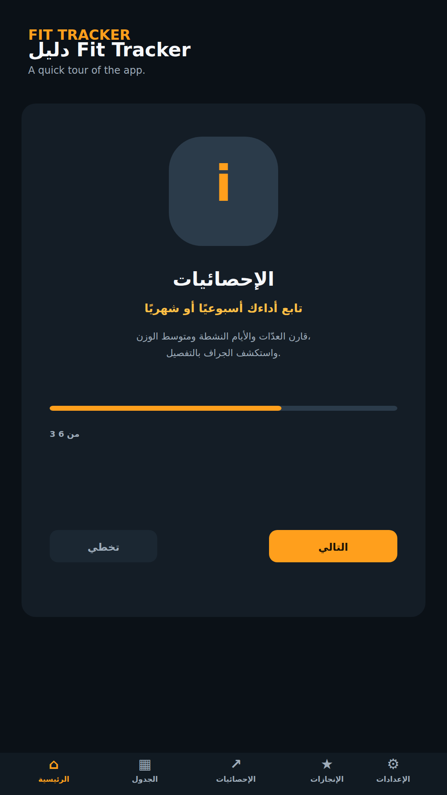

# Fit Tracker

**Fit Tracker** is a focused Android workout companion for logging exercises, tracking progress, planning weekly training, and understanding performance through clear, shareable analytics. It is designed to be fast during a workout, simple to use, and useful over time.

## Version 3.0.0

Version 3.0.0 delivers a complete workout-management experience: personalized profile setup, an interactive guide, fast workout logging, weekly planning, weekly and monthly analytics, and shareable results.

### Highlights

| Area | What Fit Tracker provides |
| --- | --- |
| Workout logging | Log exercise name, date, weight, and reps with Arabic-Indic, Persian-Indic, and English digit support. |
| User profile | Enter name, body weight, and height during first setup, then edit them from Settings. |
| Home dashboard | Personalized greeting, workout streak, total weights, total reps, total exercises, and workout history. |
| Analytics | Weekly or monthly sessions, reps, active days, average weight, and a weight-versus-reps chart. |
| Sharing | Share a formatted analytics summary with friends, WhatsApp, Telegram, or social apps through the Android share sheet. |
| Workout plan | Maintain a separate weekly plan and add or remove exercises for each day. |
| Achievements | Track unlocked achievements, workout streak, and exercise variety. |
| Interactive guide | A step-by-step tour of the app with skip support and a Settings button to reopen it. |
| Reminders | Configure a daily workout reminder down to the hour and minute. |
| Personalization | Edit the motivational phrase, choose light/dark mode, use system colors, and switch Arabic or English. |
| Data | Export and restore workout data as a local JSON backup. |

## Screenshots

> These previews highlight the main Fit Tracker 3.0.0 experience.

| Home | Analytics | Interactive guide |
| --- | --- | --- |
|  |  |  |

## Download

Download the stable release from [GitHub Releases](https://github.com/mrx7014/fit-tracker/releases/tag/v3.0.0), or use the direct APK link below:

[**Download Fit Tracker 3.0.0**](https://github.com/mrx7014/fit-tracker/releases/download/v3.0.0/app-debug.apk)

## Technical overview

Fit Tracker is built with Kotlin, Jetpack Compose, and Material 3. Workout data is stored locally on the device using SharedPreferences, with JSON export and restore for backups. The minimum supported version is Android 8.0 (API 26), and the target SDK is Android 15 (API 35).

The application is built and published through GitHub Actions. When the workflow is run with Release enabled, it updates the selected semantic version in Gradle and the app source, derives a version code, builds the APK, and publishes it to GitHub Releases.

## Developer

**MRX7014**

- Repository: [mrx7014/fit-tracker](https://github.com/mrx7014/fit-tracker)
- Releases: [GitHub Releases](https://github.com/mrx7014/fit-tracker/releases)

## Changelog

See [CHANGELOG.md](CHANGELOG.md) for the complete Arabic-first release history, followed by the English release notes.

## License

This project is licensed under the [MIT License](LICENSE). The Fit Tracker name and branding remain the property of MRX7014 unless stated otherwise.
